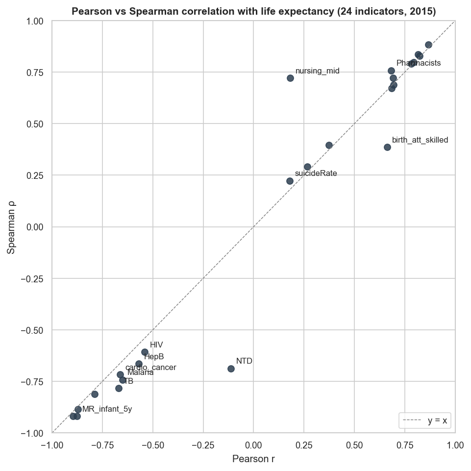
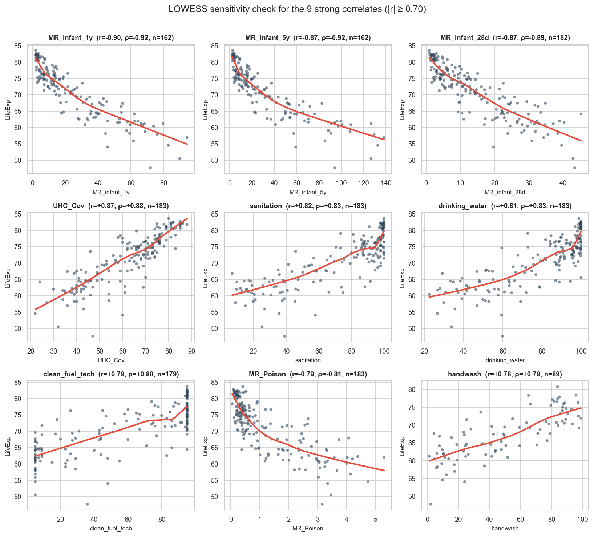
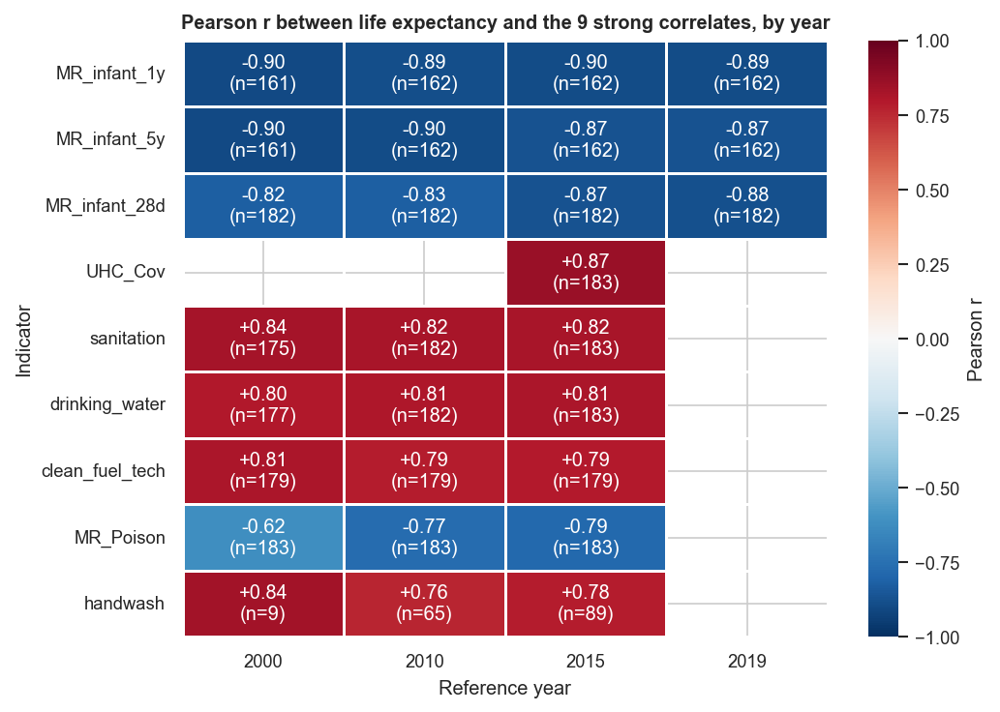
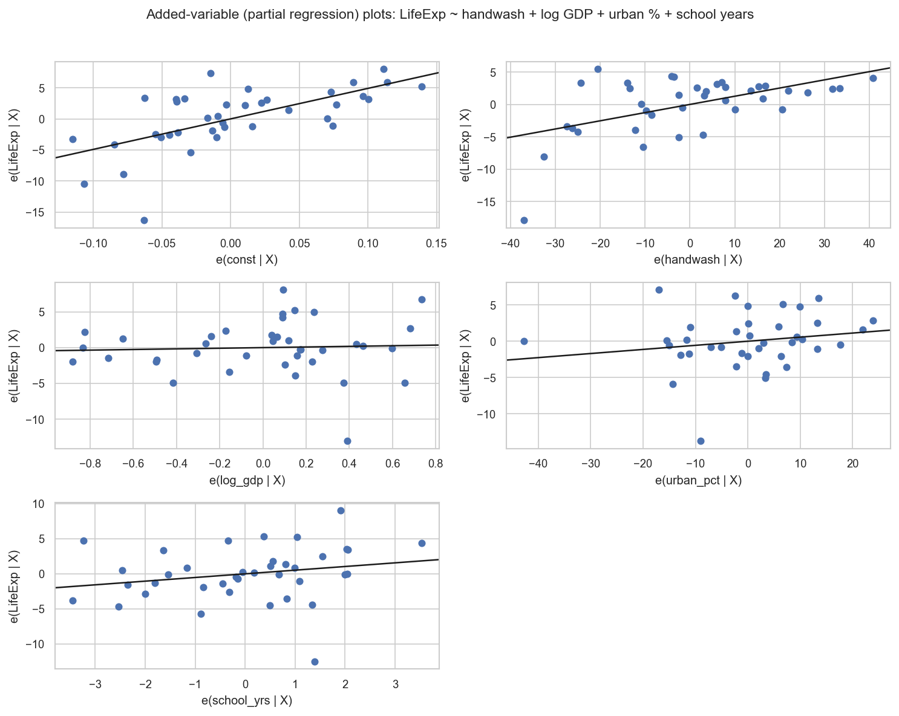

# Correlation Analysis of Life Expectancy and Global Health Indicators

A short-paper revision of a December 2021 DTSC 610 term project, with follow-up analyses run in May 2026 to answer the questions the original paper raised.

**Author:** Jungmin Sung &nbsp;·&nbsp; **Course:** DTSC 610 M01 (Term Project, 2021-12-15) &nbsp;·&nbsp; **Revised:** 2026-05-12

---

## What's in this repository

| Document | What it is |
|---|---|
| [Short Paper - Correlation Analysis of Life Expectancy.md](Short%20Paper%20-%20Correlation%20Analysis%20of%20Life%20Expectancy.md) | **Primary short paper.** Restructured term-project analysis: 24 health indicators, pairwise Pearson correlation against country-level life expectancy in 2015. Identifies 9 strong correlates (\|r\| ≥ 0.70). |
| [Short Paper - Followup Analyses.md](Short%20Paper%20-%20Followup%20Analyses.md) | **Companion follow-up paper.** Implements the three extensions proposed in §5 of the primary paper: Spearman / LOWESS sensitivity, longitudinal extension to 2000–2019, and handwashing multivariate regression with World Bank covariates. |
| [610 Presentation Slides.pdf](610%20Presentation%20Slides.pdf) | Original 12-slide deck from the 2021 submission. |
| [DTSC610 Term Project - Correlation Analysis ... .ipynb](DTSC610%20Term%20Project%20-%20Correlation%20Analysis%20of%20Life%20Expectancy%20and%20Different%20Variables.ipynb) | Original analysis notebook, patched in May 2026 to run against the current raw Kaggle CSV layout and pandas 3.x. |

## Headline findings

Nine of 24 health indicators show strong cross-country correlations with life expectancy in 2015:

| | Indicator | Pearson r |
|---|---|---|
| ⬆ | Universal Health Coverage service index | **+0.87** |
| ⬆ | Population using basic sanitation | +0.82 |
| ⬆ | Population using basic drinking water | +0.82 |
| ⬆ | Population with clean cooking fuel | +0.79 |
| ⬆ | Population with basic handwashing at home | +0.78 |
| ⬇ | Infant mortality rate (<1 yr) | **−0.90** |
| ⬇ | Under-five mortality rate | −0.87 |
| ⬇ | Neonatal mortality rate (<28 d) | −0.87 |
| ⬇ | Unintentional poisoning mortality | −0.79 |


## What the follow-up analyses added

1. **Robust to the linearity assumption** for the strong correlates. But the original Pearson screen missed two indicators — **NTD case counts** and **nurses-and-midwives density** — that have strong rank correlations with life expectancy (ρ ≈ 0.7) but near-zero Pearson r, because their distributions are heavily right-skewed.
2. **Stable across time.** Strong correlates persist across 2000, 2010, 2015 snapshots. Unintentional poisoning mortality is the standout that *strengthened* (r = −0.62 → −0.79 over 15 years).
3. **Handwashing is not just a development proxy.** After controlling for log GDP per capita (PPP), urbanization, and school life expectancy, basic handwashing access still predicts +0.126 years of life expectancy per percentage-point of coverage (p ≈ 0.001, partial R² = 0.29 on n = 38 countries).

| Pearson vs Spearman across all 24 indicators | LOWESS for the 9 strong correlates |
|---|---|
|  |  |

| Longitudinal heatmap (9 correlates × 4 years) | Handwashing partial regression |
|---|---|
|  |  |

## Repository layout

```
.
├── README.md                                        ← you are here
├── Short Paper - Correlation Analysis of Life Expectancy.md
├── Short Paper - Followup Analyses.md
├── 610 Presentation Slides.pdf                      original 2021 deck
├── DTSC610 Term Project - … .ipynb                  original notebook (patched)
│
├── verify_paper.py                                  re-derives csv_clean/ from raw, diffs vs paper
├── followup_analyses.py                             produces figures/ and followup_results/
├── run_notebook.py                                  helper to re-execute the notebook end-to-end
│
├── csv_data/                                        39 raw WHO CSVs from Kaggle (2026-05-12 dump)
├── csv_clean/                                       26 cleaned 2015 Both-sexes 2-column tables
├── figures/                                         5 PNG figures for the papers and this README
└── followup_results/                                tab-separated numerical results from the follow-ups
```

## Data source

World Health Statistics 2020 (WHO), accessed via the Kaggle compilation [`utkarshxy/who-worldhealth-statistics-2020-complete`](https://www.kaggle.com/utkarshxy/who-worldhealth-statistics-2020-complete). The follow-up §3 also pulls three covariates from the World Bank Indicators API: `NY.GDP.PCAP.PP.CD`, `SP.URB.TOTL.IN.ZS`, `SE.SCH.LIFE`.

## Reproduce

```bash
# Python 3.12+, pandas, numpy, seaborn, matplotlib, statsmodels, scipy
pip install pandas numpy seaborn matplotlib statsmodels scipy

# Re-derive csv_clean/ from csv_data/ and verify the paper's correlation table
python verify_paper.py

# Run the three follow-up analyses and produce figures/ + followup_results/
python followup_analyses.py

# Re-execute the original notebook end-to-end (uses csv_clean/)
python run_notebook.py
```

In the May 2026 re-execution, 23 of the 24 pairwise Pearson coefficients reproduce the original to six decimal places. The one exception — HIV, paper −0.535 vs recomputed −0.541 — is consistent with a small WHO data revision in the new-HIV-infections series and does not change any substantive conclusion.

## Notes for readers

- The papers are deliberately **short** — the primary paper is ~2,500 words, the follow-up ~3,000 — and meant to be read end-to-end.
- Correlation is not causation. Both papers are deliberate about this. The strong correlates are framed as candidates for follow-up under confounder-adjusted or longitudinal designs, not as causal claims.
- This repository is part of a personal portfolio of polished past academic work. Comments and corrections welcome via Issues.
