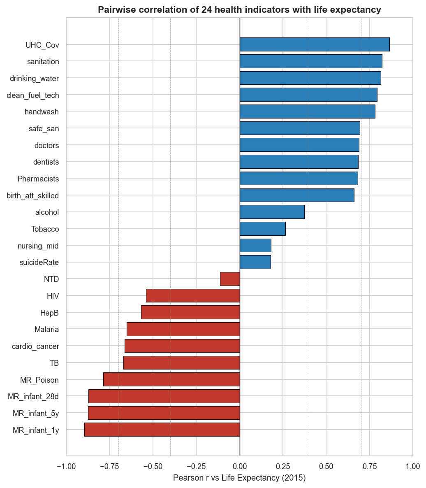

Cross-country correlation analysis of 24 WHO health indicators against
country-level life expectancy &mdash; 2015 reference year, 183 countries.
A May 2026 polish of a December 2021 DTSC 610 term project by Jungmin Sung.

## Start here

- 📊 **[Interactive Dashboard](dashboard.html)** &mdash; world map, indicator-dropdown country explorer, longitudinal heatmap, six sections in one page.
- ⏱ **[Executive Summary](Executive%20Summary.md)** &mdash; one page, key findings + headline figure.
- 📄 **[Primary Visual Data Report](Visual%20Data%20Report%20-%20Correlation%20Analysis%20of%20Life%20Expectancy.md)** &mdash; methodology, full 24-indicator ranking, limitations, references.
- 🔬 **[Follow-up Analyses](Visual%20Data%20Report%20-%20Followup%20Analyses.md)** &mdash; Spearman / LOWESS sensitivity, longitudinal extension to 2000&ndash;2019, handwashing multivariate regression with World Bank covariates.

## Headline finding



Nine of 24 health indicators cross the strong-correlation threshold (|Pearson r| ≥ 0.70). They split cleanly into two clusters:

**Access to basic services (positive)**

- UHC service coverage index &nbsp;**+0.87**
- Basic sanitation &nbsp;+0.82
- Basic drinking water &nbsp;+0.82
- Clean cooking fuel reliance &nbsp;+0.79
- Basic handwashing at home &nbsp;+0.78

**Early-life mortality (negative)**

- Infant mortality, &lt; 1 yr &nbsp;**−0.90**
- Under-five mortality &nbsp;−0.87
- Neonatal mortality, &lt; 28 d &nbsp;−0.87
- Unintentional poisoning mortality &nbsp;−0.79

## What the follow-up analyses added

1. **Robust to method choice.** Pearson and Spearman agree on the nine strong correlates. But the Pearson screen missed two indicators &mdash; **NTD** case counts and **nurses-and-midwives** density &mdash; that are strong rank-correlates with life expectancy, because their distributions are heavily right-skewed.
2. **Stable across two decades.** Repeating the analysis at 2000, 2010, 2015 (and 2019 where covered) shows the same picture, with one notable exception: unintentional poisoning mortality strengthens from r = &minus;0.62 in 2000 to &minus;0.79 in 2015.
3. **Handwashing is not just a development proxy.** Controlling for log GDP per capita (PPP), urbanisation, and school life expectancy, basic handwashing still predicts **+0.126 years per percentage-point** of coverage (p ≈ 0.001, partial R² = 0.29). A country moving from 30 % to 80 % basic handwashing coverage is predicted to gain ≈ 6.3 years of life expectancy, holding development covariates fixed.

## Data &amp; reproducibility

Source: WHO [World Health Statistics 2020](https://www.who.int/data/gho/publications/world-health-statistics)
via the Kaggle compilation `utkarshxy/who-worldhealth-statistics-2020-complete`.
World Bank Indicators API for GDP / urbanisation / education covariates in the follow-up §3.

The entire pipeline is reproducible from the included Python scripts:

```text
verify_paper.py        # raw csv_data/ -> cleaned csv_clean/ + diff vs report values
followup_analyses.py   # Spearman, longitudinal, multivariate -> figures/ + followup_results/
make_dashboard.py      # all of the above -> dashboard.html
```

In a May 2026 re-execution, 23 of 24 pairwise Pearson coefficients reproduce the original 2021 report to six decimal places. The single exception is HIV (paper &minus;0.535 vs recomputed &minus;0.541), consistent with a small WHO data revision.

## Caveat

Correlation is not causation. The analysis is ecological (country-level), cross-sectional, and unadjusted (with the exception of the follow-up §3 multivariate). Strong correlates are framed as candidates for follow-up under confounder-adjusted or longitudinal designs, not as causal claims.
